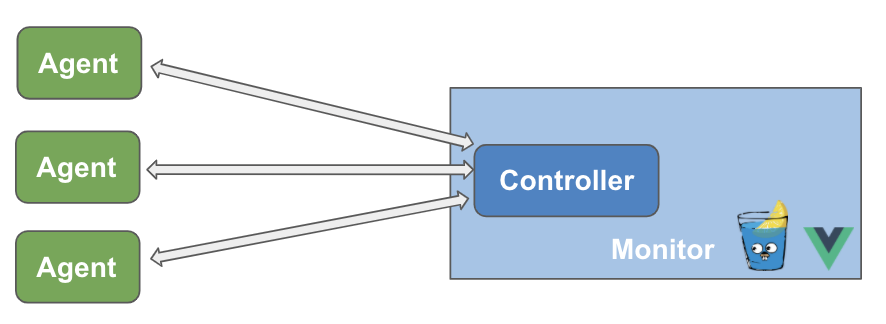

[](https://travis-ci.org/VertexC/log-formatter)
[](https://goreportcard.com/report/github.com/VertexC/log-formatter)
[](https://codecov.io/gh/VertexC/log-formatter)
# Log Formatter: Logstash in Golang
**Log Formatter** is a **light-weight** and **extensible** and **production-ready** framework in golang to process log data like [Logstash](https://github.com/elastic/logstash). It ingests data from `input` as documents, then each document is processed (filter/drop/enhance) by `pipeline`, and finally sent to `output`.

## Features
**Log Formatter** has **Agent** and **Monitor** component.

**Agent**
- one to one streaming
- dynamic configurable
- multilevel native logging and prometheus metric

**Monitor**
- show agent’s current status
- modify configuration on the fly

## Usage and Example
### Standalone Agent
`go run agent.go -c config.yml`

The config file is in yaml format, which should include `input`, `output`, `pipeline`. Here is an exmaple to forward message from Kafka to Kafka.
```
input:
    kafka:
        brokers: 
            - "127.0.0.1:9092"
        topic: "test01"
        group_name: "formatter-test"
        version: "2.6.0"
output:
    kafka:
        broker: "127.0.0.1:9092"
        topic: "test02"
pipeline:
    formatters:
        - forwarder:
```

#### Agent Plugin
See tutorial on how to write your own plugin. [TODO:]

**Native Supported Plugins**
- Input: console, kafka, es
- Output: console, kafka, es
- Formatter: parser, filter, forwarder

### Monitor: A stateless Web Server with Gin+Vue
**Monitor** and **Agent** communicate by grpc.



Deploy agents with monitor
```bash
# agent
`go run agent.go -c config.yml -monitor <web-rpc-port> -rpcp <agent-rpc-port>   `
# controller
`go run monitor.go -rpcp <web-rpc-port> -webp <web-port>
```

You can try to play around with monitor's web interface by running `docker-compose -f deployment/docker-compose.yaml up`, which will set up a monitor on `localhost:8080` with 10 agents.

### Docker and K8S deployment
The docker images are available on https://hub.docker.com/u/formatter.